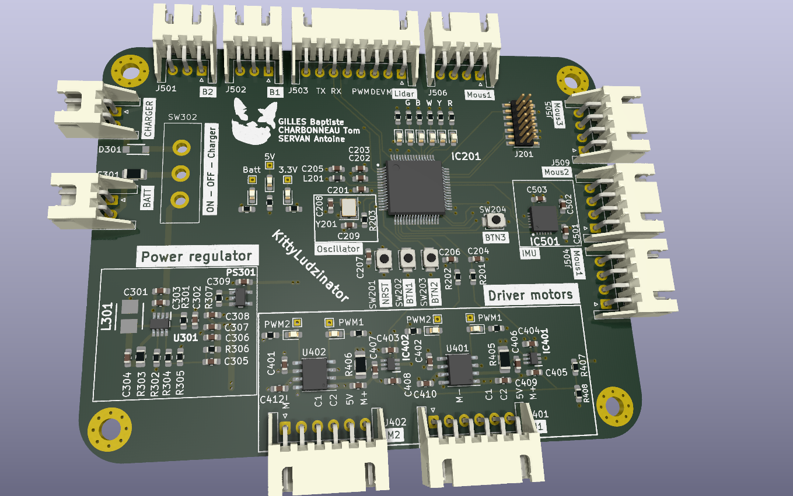
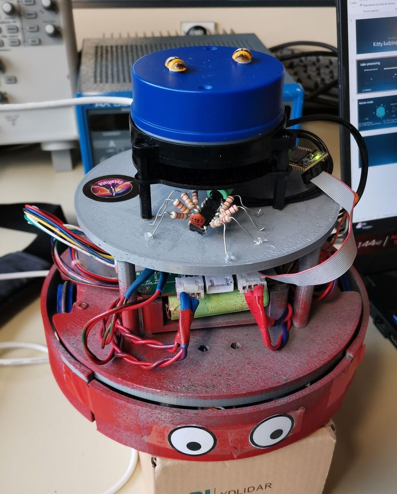

# KittyLudzinator Project 

This project aims to create and programm a PCB, in  order to build a robot equipped with various sensors such as an IMU, a Lidar, or motion sensors. This robot's objective is to be able to play TAG against others cat robots. When one robot is touched, it becomes the cat and must chase the other robots. To accomplish this, one of the key goals is to develop a complex algorithm capable of understanding its environment, determining its location, and effectively interacting with other robots, either by tagging them or evading them when it's not the cat.

CHARBONENAU TOM

SERVAN Antoine

GILLES Baptiste

## Aperçu

## Contenu du Répertoire

Le projet est organisé de la manière suivante :

- **/Code_Chat_V4.0** : Contient le programme du robot.
- **/Autres Codes** : Contient d'autres versions du programme ainsi que le driver du LIDAR.
- **/Doxygen** : Contient les fichiers du Doxygen.
- **/Doc/Testmoteur** : Contient les fichiers de conception KiCad de la carte test afin de choisir le meilleur capteur de courant.
- **/Kyttiludzinator** : Contient les fichiers de conception KiCad, y compris le schéma, le PCB et les bibliothèques personnalisées.
- **/Doc/Image** : Images et captures d'écran pour la documentation.
- **/Doc/Composants** : Pour tout autre fichier pertinent, par exemple, des modèles 3D, les empreintes des composants ect 

## Logiciel Requis

- KiCad 5.0 ou supérieur : Un outil de conception électronique open-source. [Télécharger KiCad](https://kicad-pcb.org/download/)
- 
## How to use ?
1. Components

In [Components_Table.cvs](Doc/Components_Table.cvs) you can find all the components uses in this project

2. Kicad

Launch [Kittyludzinator](Doc/Kyttiludzinator/Kyttiludzinator.kicad_pro) to open the project with KICAD

3. Ouput file

Launch [Kittyludzinator](Doc/Kyttiludzinator/Kyttiludzinator.kicad_pro) to see the gerbers files

