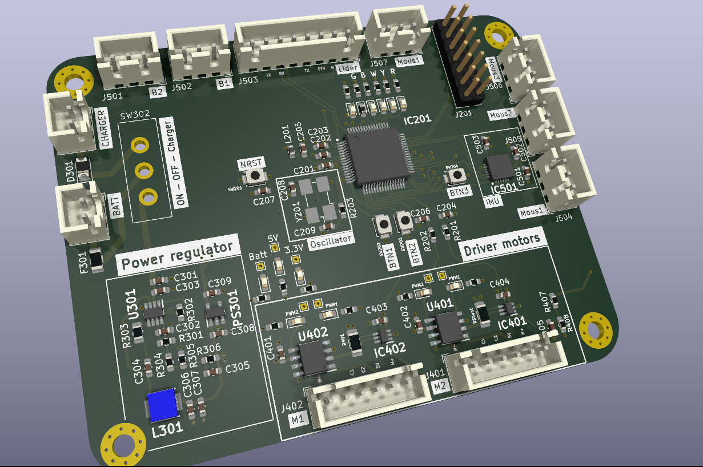

# KittyLudzinator Project 

This project aims to create a PCB card for controlling a robot equipped with various sensors such as IMU, Lidar, or motion sensors. The primary objective is to enable the robot to engage in a game of cat and mouse. When one robot is touched, it becomes the cat and must chase the other robots. To accomplish this, one of the key goals is to develop a complex algorithm capable of understanding its environment, determining its location, and effectively interacting with other robots, either by tagging them or evading them when it's not the cat.

## PCB

## How to use ?
1. Components

In [Components_Table.cvs](Components_Table.cvs) you can find all the components uses in this project
2. Kicad

Launch [Kittyludzinator](Kyttiludzinator/Kyttiludzinator.kicad_pro) to open the project with KICAD

3. Ouput file

