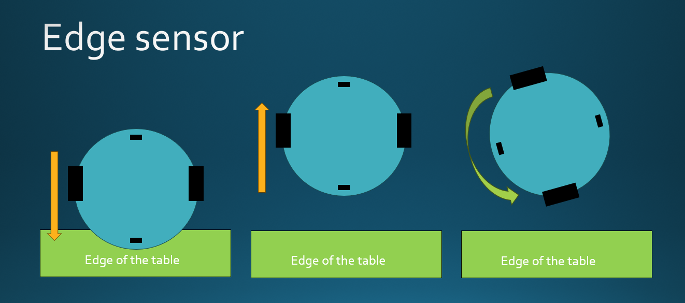

# KittyLudzinator Project

## Project Overview
The KittyLudzinator Project is focused on developing a playful autonomous robot equipped with an array of sensors including IMUs, Lidar, and motion detectors. It engages in a game of TAG, showcasing its ability to navigate and interact within its environment.

CHARBONENAU TOM

SERVAN Antoine

GILLES Baptiste

## Table of Contents
- [Project Overview](#project-overview)
- [Installation](#installation)
- [Usage](#usage)
- [Robot Strategy](#robot-strategy)
- [Doxygen](#Doxygen)
- [IMU](#IMU)
- [Directory Structure](#directory-structure)
- [License](#license)
- [Acknowledgments](#acknowledgments)
- [Contact Information](#contact-information)

## Installation
Refer to the [PCB](/PCB) directory for detailed component tables , PCB info and setup documentation. The software setup is managed through STM32CubeMX configurations (`Ludz_le_chat.ioc`), 

## Usage
The source code is located in [Code_Chat_V4.0](/Code_Chat_V4.0) with core functions in [Core](/Code_Chat_V4.0/Core).

The Lidar and motor drivers are in [drv_LIDAR](/Code_Chat_V4.0/drv_LIDAR) and [drv_Motor](/Code_Chat_V4.0/drv_Motor), respectively.

## Robot Strategy
Strategies for robot behavior in different modes are implemented as follows:

### Lidar Processing
Processes Lidar sensor data to track objects. Details are in the script [LIDAR_Receive_clusters.py](/LIDAR_Receive_clusters.py).

### Mouse Mode
The robot moves away from the tagger, inversely proportional to the angle of the tagger's approach.

### Hunter Mode
The 'it' robot aggressively seeks the nearest robot, adjusting its motor speed using a linear function.

### Edge Sensor
Edge detection prevents the robot from falling off ledges.

## Doxygen

## IMU
[IIMU](<Autres Codes/Code_IIM2070_SPI>) :This file includes instructions for operating the IIM2070 device, as detailed in the script code 'IIM2070_SPI

## Directory Structure
- [Code_Chat_V4.0](/Code_Chat_V4.0): Active robot code.
- [PCB](/PCB): Documentation, components and manufacturing file for PCB.
- [Doxygen](/Doxygen): Generated code documentation.
- [Autres Codes](/Autres_Codes): Previous versions and experimental code.

## License
The project is under the MIT License.

## Acknowledgments
Thanks to contributors and the open-source community.

## Contact Information
Contact the maintainer at .
[tom.charbonneau2001@gmail.com](mailto:tom.charbonneau2001@gmail.com) | [baptiste.gilles01@gmail.com](mailto:baptiste.gilles01@gmail.com)   |  [servan.antoine@gmail.com](mailto:servan.antoine@gmail.com)

